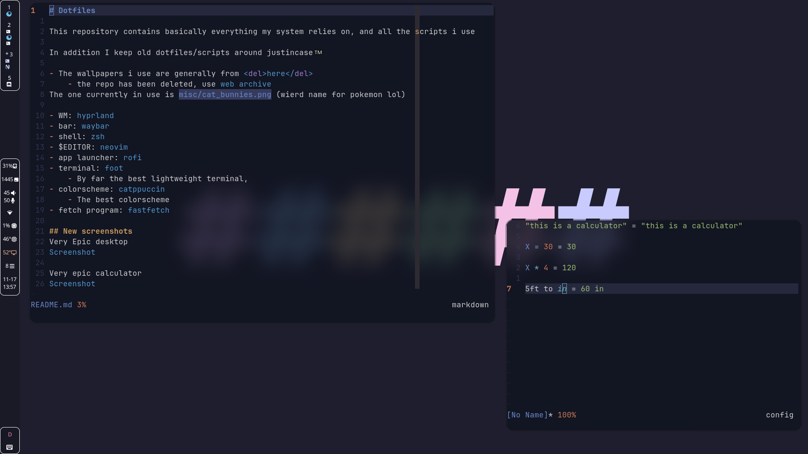

# Dotfiles

This repository contains basically everything my system relies on, and all the scripts i use

In addition I keep old dotfiles/scripts around justincase™️

- The wallpapers i use are generally from <del>[here](https://github.com/Gingeh/wallpapers)</del>
    - the repo has been deleted, use [web archive](https://cloud/wallpapers-mirror/)
The one currently in use is `minimalistic/hashtags-black.png`

- WM: [hyprland](https://github.com/hyprwm/Hyprland)
- bar: [waybar](https://github.com/Alexays/Waybar/)
- shell: [zsh](https://www.zsh.org/)
- $EDITOR: [neovim](https://neovim.io)
- app launcher: [rofi](https://github.com/DaveDavenport/rofi)
- terminal: [foot](https://codeberg.org/dnkl/foot)
    - By far the best lightweight terminal,
- colorscheme: [catppuccin](https://github.com/catppuccin/catppuccin)
    - The best colorscheme
- fetch program: [fastfetch](https://github.com/fastfetch-cli/fastfetch)

## Screenshots

Very Epic desktop

Emoji selector
[!Screenshot](./Pictures/system-images/dotfiles-emoji-selector.png)
