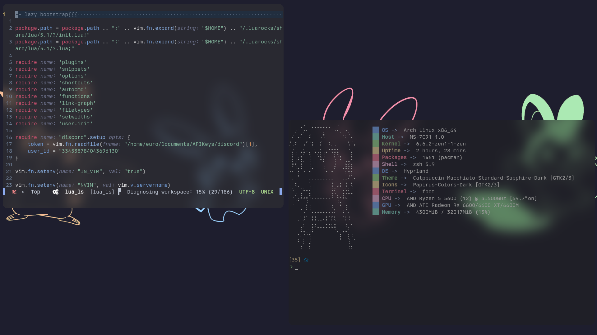
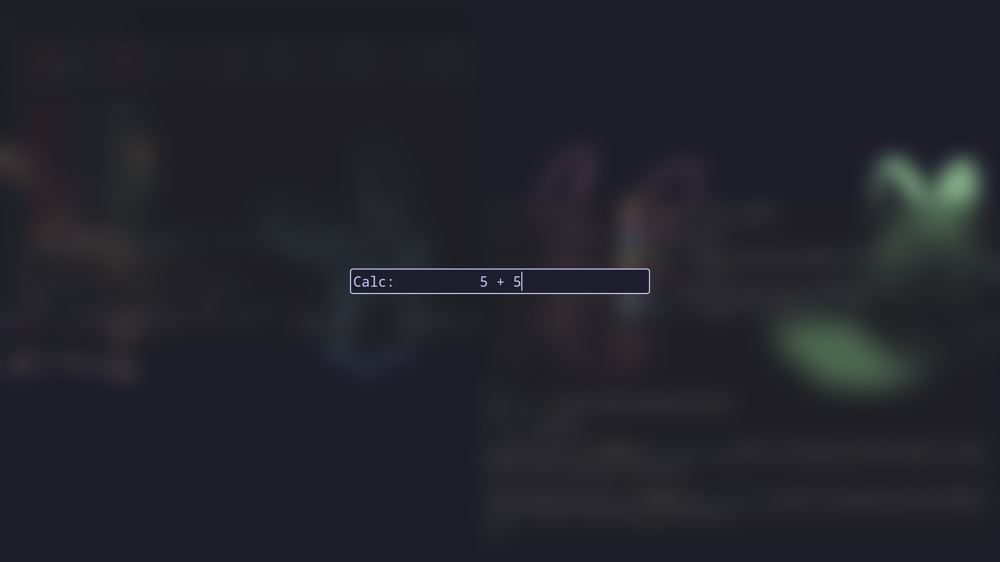

# Dotfiles

- The wallpapers i use are generally from [here](https://github.com/Gingeh/wallpapers)
The one currently in use is `misc/cat_bunnies.png` (wierd name for pokemon lol)

- WM: [hyprland](https://github.com/hyprwm/Hyprland)
- bar: [waybar](https://github.com/Alexays/Waybar/)
- shell: [zsh](https://www.zsh.org/)
- $EDITOR: [neovim](https://neovim.io)
- app launcher: [rofi](https://github.com/DaveDavenport/rofi)
- terminal: [foot](https://codeberg.org/dnkl/foot)
    - By far the best lightweight terminal,
- colorscheme: [catppuccin](https://github.com/catppuccin/catppuccin)
    - The best colorscheme

Very epic Desktop

Very epic calculator

